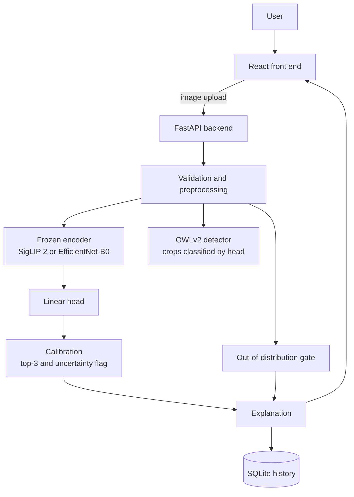

# ASTRA VISION

Explainable defence object recognition. Upload an image and get the class, a calibrated confidence, top-3 alternatives and a plain-English explanation. It warns when unsure and rejects images with no defence object.

**[Live demo](https://sentinel-vision-seven.vercel.app)** · [How the model works](docs/model-explained.md) · [Technical details](docs/technical-details.md) · Challenge 02 (ASTRA 3-Day Build), solo entry

Free and local: open-weight models, no paid APIs, no API keys.

## Results

Held-out, 117 cleaned images, group-aware 5-fold CV × 3 repeats:

| Model | Accuracy | Top-3 | Macro F1 |
|---|---|---|---|
| **SigLIP 2 + trained head** (default) | **99.2%** | 100% | 0.991 |
| SigLIP 2 zero-shot | 99.2% | 100% | 0.991 |
| EfficientNet-B0 + trained head | 91.2% | 99.2% | 0.906 |

- The out-of-distribution gate rejects 10/10 unrelated images, with a 3.4% false-rejection rate on real defence images.
- The dataset is small and skews to old photos, so real-world accuracy will be lower. See [limitations](docs/technical-details.md#limitations).
- Full metrics are in [`reports/`](reports/).

## Architecture



Every classifier is a frozen pretrained encoder plus a small linear head, so one calibration and evaluation path serves all models. More in [technical details](docs/technical-details.md#architecture).

## Features

- 5 classes: aircraft, helicopter, drone/UAV, land vehicle, naval vessel
- Top-3, calibrated confidence and an "uncertain" flag
- Plain-English text explanations
- Multi-object detection (OWLv2), batch/zip upload, prediction history
- Robust input handling: corrupt, oversized and non-image files return clear errors
- React front end (`web/`) deployed on Vercel

## Quick start

```bash
git clone https://github.com/ShaunT06/astra-vision.git && cd astra-vision
python -m venv .venv && source .venv/bin/activate   # Windows: .venv\Scripts\activate
pip install -r requirements.txt --extra-index-url https://download.pytorch.org/whl/cpu
uvicorn app.main:app --reload                        # API docs at http://localhost:8000/docs
```

Front end: `cd web && npm install && npm run dev`. Docker: `docker build -t astra-vision . && docker run -p 7860:7860 astra-vision`.

Tests: `pytest -q`

## Structure

```text
app/       FastAPI backend       scripts/  train / evaluate / export
models/    trained heads         reports/  metrics and confusion matrices
web/       React + Vercel        docs/     build plan and details
```

## AI usage

Built with Claude Code for research, code, tests and documentation. Verified with 35 automated tests, group-aware cross-validation and a manual audit of all 150 starter images.

## License

MIT. Model weights and images keep their own licences.
