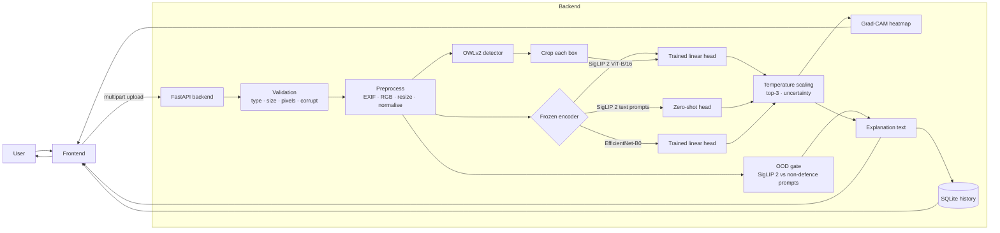

<div align="center">

# ASTRA VISION

**Free, explainable defence object recognition — upload an image, get a class, a calibrated confidence, a heatmap and a plain-English explanation.**

[](https://github.com/ShaunT06/astra-vision/actions/workflows/ci.yml)


[Live demo](https://sentinel-vision-seven.vercel.app) · [Results](#results-held-out) · [Features](#features) · [Quick start](#setup) · [API](#api) · [Limitations](#limitations)

</div>

ASTRA Software Team 3-Day Build Challenge · Challenge 02 (AI-Based Defence Object Recognition) · solo entry

Upload an image → the system identifies the defence object (military aircraft, helicopter, drone/UAV, land vehicle, naval vessel), shows a calibrated confidence, top-3 alternatives, a heatmap of *where* the model looked, and a plain-English explanation. It warns when it is unsure and says so when the image contains no defence object at all. A detection mode finds and labels multiple objects in one image.

Everything is **free and runs locally**: open-weight models, no paid APIs, no API keys.

**Live demo: [sentinel-vision-seven.vercel.app](https://sentinel-vision-seven.vercel.app)** (ONNX classifier; heatmaps and multi-object detection need the full backend, see [Web app](#web-app-web)).

---

## Results (held-out)

117 cleaned ASTRA starter images, group-aware 5-fold cross-validation × 3 repeats (photos from the same series never appear in both train and test):

| Model | Accuracy | Top-3 | Macro F1 | Calibration error (ECE) before → after |
|---|---|---|---|---|
| **SigLIP 2 + trained head** (default) | **99.2% ± 0.7** | 100% | 0.991 | 0.016 → 0.009 |
| SigLIP 2 zero-shot (no training) | 99.2% | 100% | 0.991 | 0.037 → 0.010 |
| EfficientNet-B0 + trained head | 91.2% ± 0.8 | 99.2% | 0.906 | 0.032 → 0.035 |

**Per-class results, default model (SigLIP 2 + trained head):**

| Class | Images | Precision | Recall | F1 |
|---|---|---|---|---|
| Military Aircraft | 22 | 0.971 | 1.000 | 0.985 |
| Military Helicopter | 27 | 0.988 | 1.000 | 0.994 |
| Drone / UAV | 20 | 1.000 | 0.967 | 0.983 |
| Military Land Vehicle | 27 | 1.000 | 1.000 | 1.000 |
| Naval Vessel | 21 | 1.000 | 0.984 | 0.992 |

**How to read this:** accuracy is the share of held-out images labelled correctly; top-3 is how often the right class is among the three best guesses; ECE measures whether stated confidence matches real accuracy (lower is better, and "90%" should mean about 90%). Temperature scaling is what brings ECE down.

- **Per class:** SigLIP stays ≥ 97% precision and recall on every class. EfficientNet's weak class is **Drone / UAV** (75% precision / 78% recall): it confuses drones with aircraft and helicopters.
- **Out-of-distribution gate:** rejects **10/10** unrelated images (maps, people, landscapes, aerial photos taken *by* drones), with a **3.4%** false-rejection rate on real defence images.
- Confusion matrices: [`reports/`](../reports/) · full numbers: [`reports/metrics.json`](../reports/metrics.json) · every held-out mistake: `reports/errors_<model>.csv`.

> **Honesty note:** 117 images is small, and the starter set skews towards WWII/Korean-war photos and 19th-century engravings. These numbers describe *this* data; real-world imagery (different angles, weather, modern camouflage) will be harder. See [Limitations](#limitations).

---

## Features

**Core (MUST HAVE)**
- Image upload → ML model → predicted class + confidence + explanation

**SHOULD HAVE**
- Top-3 predictions with confidences
- Preprocessing: EXIF rotation, RGBA/grayscale/CMYK/palette/16-bit → RGB, transparency flattened, animated GIF → first frame, resize + normalise per model
- Low-confidence warning: flags "uncertain" when confidence is below a threshold **tuned on held-out data**, or when the top two classes are within 10 points
- Bad-input handling with clear JSON errors: empty file, non-image, corrupt/truncated image, unsupported format, file too large, decompression bomb, tiny image; one bad file never fails a batch
- Written model justification ([below](#why-these-models))

**BONUS**
| Bonus | Implementation |
|---|---|
| Transfer learning on own data | Logistic-regression heads trained on frozen SigLIP 2 / EfficientNet-B0 features |
| Explainable AI | Grad-CAM heatmaps for every model (eigen-smoothed for the ViT) |
| Model comparison | 3 models, identical folds, same metrics |
| Performance metrics | Accuracy, top-3, per-class precision/recall/F1, confusion matrices, calibration (ECE/NLL) |
| Multi-object detection | OWLv2 open-vocabulary boxes → each crop classified by our model |
| Batch processing | Many images or a `.zip` → per-image results, summary counts, CSV |
| History / gallery | SQLite store of every prediction with thumbnail |
| Extra | Out-of-distribution gate, temperature-scaled (calibrated) confidence, data audit with documented exclusions |

---

## Web app (`web/`)

A React + Vite front end ("Sentinel Vision"): radar intro, hero, telemetry archive and a classification workbench. It calls
`POST /api/classify`, which returns `{id, filename, label, confidence, detections[{x,y,width,height}], mode, processed_at}`
from the real SigLIP / EfficientNet models (boxes come from the Grad-CAM hot region, or OWLv2 with `?detect=true`).

```bash
uvicorn app.main:app --port 8000      # backend
cd web && npm install && npm run dev  # front end on :5173, proxies /api to :8000
```

**Deploy on Vercel:** `cd web && vercel deploy --prod`. The static front end and a Python serverless function ship together.
`web/api/index.py` runs the SigLIP 2 encoder as ONNX (no PyTorch) with the trained probe head and the out-of-distribution
gate; it matches the PyTorch labels on 30/30 starter images. Regenerate the model files with `python -m scripts.export_onnx`
and re-check with `python -m scripts.check_onnx_parity`.

Serverless limits: uploads are capped near 4 MB (the UI shrinks large frames first) and the function reports a whole-frame
classification region. Per-object boxes (OWLv2) and Grad-CAM heatmaps need PyTorch, so they exist only in the FastAPI
backend (`app/main.py`, `Dockerfile`).

---

## Architecture



**Data flow for one prediction**
1. **Validation** (`app/validation.py`) — rejects bad files with a specific error code and HTTP status.
2. **Preprocess** — orientation + colour-mode fixes, then each model's own resize/normalise.
3. **Encoder + head** (`app/models/`) — every classifier is *frozen backbone → linear head*.
4. **Post-processing** (`app/inference.py`) — softmax with a fitted temperature, top-3, uncertainty flags.
5. **OOD gate** — SigLIP 2 compares the image with defence prompts vs. non-defence prompts (animal, person, food, landscape, map/diagram, civilian car/airliner/ship…). If a non-defence concept wins, the answer is *"No defence object recognised"*.
6. **Grad-CAM** — gradients of the predicted class flow back to the last conv layer (CNN) or last transformer block (ViT).
7. **History** (`app/db.py`) — stored in SQLite with a thumbnail.

**Offline pipeline** (`scripts/`): `prepare_data` (audit exclusions, validation, near-duplicate grouping) → `train` (fit heads) → `evaluate` (cross-validated comparison, calibration, thresholds, reports).

### Why this architecture
- **Frozen backbone + linear head** instead of fine-tuning a whole network: with ~23 images per class, full fine-tuning overfits; linear probes on strong pretrained features are the standard few-shot recipe, train in seconds on a laptop CPU, and the trained head is only 20 KB.
- **Every model ends in `nn.Linear`**, so one Grad-CAM implementation, one calibration method and one evaluation script serve all three models, making the comparison fair.
- **Two-stage detection** (detector for *where*, our classifier for *what*) adds bounding boxes without any box-labelled training data.
- **API-first** — the backend is frontend-agnostic JSON with auto-generated docs at `/docs`.

---

## Why these models

| Model | Licence | Role | Why |
|---|---|---|---|
| **SigLIP 2** `google/siglip2-base-patch16-224` | Apache 2.0 | Main encoder, zero-shot baseline, OOD gate | Google's 2025 successor to CLIP. Trained on billions of image–text pairs, so it already "knows" tanks, frigates and quadcopters, and it can compare images with text — which gives us zero-shot classification and the OOD gate for free. |
| **EfficientNet-B0** (timm) | Apache 2.0 | Comparison model | A small (5M-parameter) ImageNet CNN — the classic transfer-learning baseline. Shows how much a modern vision-language encoder adds (+8 points). |
| **OWLv2** `google/owlv2-base-patch16-ensemble` | Apache 2.0 | Detection | Open-vocabulary detector: finds boxes for text queries like "a tank" without box-labelled data. |
| **Grad-CAM** (`grad-cam`) | MIT | Explainability | Standard, model-agnostic class-activation maps. |

Rejected: YOLO-World / Ultralytics (GPL/AGPL licence, and standard YOLO needs box labels), Grounding DINO 1.5/1.6 (paid API), cloud vision APIs (not free), full fine-tuning (too little data).

---

## Repository structure

```text
.
├── app/                 FastAPI backend
│   ├── main.py          routes: predict, detect, batch, history, metrics, classify
│   ├── validation.py    image validation + preprocessing (EXIF, colour modes, size limits)
│   ├── inference.py     calibration, top-3, uncertainty, OOD gate, explanations, Grad-CAM
│   ├── detector.py      OWLv2 open-vocabulary detection
│   ├── db.py            SQLite prediction history
│   ├── config.py        settings (env-overridable)
│   └── models/          SigLIP 2 and EfficientNet-B0 wrappers (frozen encoder + linear head)
├── scripts/             offline pipeline: prepare_data, train, evaluate, export_onnx, check_onnx_parity
├── models/              trained heads (~20 KB each) and tuned thresholds
├── dataset/             manifest.csv and exclusions.csv (data audit)
├── reports/             metrics.json, confusion matrices, per-model error lists, Grad-CAM comparison
├── tests/               pytest suite
├── web/                 React + Vite front end and Vercel serverless (ONNX) function
├── docs/                build plan and design notes
├── Dockerfile           Hugging Face Spaces / any Docker host
└── .github/             CI workflow, issue and PR templates
```

---

## Setup

Requirements: Python 3.12–3.14, ~3 GB disk for model weights (downloaded automatically on first run).

```bash
git clone https://github.com/ShaunT06/astra-vision.git
cd astra-vision
python -m venv .venv
source .venv/bin/activate          # Windows: .venv\Scripts\activate
pip install -r requirements.txt --extra-index-url https://download.pytorch.org/whl/cpu
```

> **Windows note:** if `import torch` fails with *"An Application Control policy has blocked this file"*, Windows **Smart App Control** is blocking PyTorch's DLLs. Don't turn it off (it can't be turned back on without reinstalling Windows) — run the project inside **WSL (Ubuntu)** instead, where the same commands work.

**Environment variables** — none required (no API keys). Optional settings are in [`.env.example`](../.env.example); copy it to `.env` to change them.

### Run the API
```bash
uvicorn app.main:app --reload
```
Open **http://localhost:8000/docs** to try every endpoint in the browser.

### Rebuild the model from data (optional — trained heads are committed in `models/`)
1. Download the ASTRA starter bundle and unzip it into `data/starter/` so that `data/starter/ASTRA-Challenge-Starter/challenge-02-vision/labels.csv` exists.
2. Run:
```bash
python -m scripts.prepare_data   # audit exclusions, validate, group near-duplicates -> dataset/manifest.csv
python -m scripts.train          # fit heads -> models/*.npz
python -m scripts.evaluate       # cross-validated comparison -> reports/, models/thresholds.json
```

### Run with Docker (also used for Hugging Face Spaces)
```bash
docker build -t astra-vision .
docker run -p 7860:7860 astra-vision
```

---

## API

| Method | Endpoint | Purpose |
|---|---|---|
| `POST` | `/api/predict?model=siglip-probe` | Classify one image: class, confidence, top-3, uncertainty, OOD result, explanation, Grad-CAM heatmap |
| `POST` | `/api/detect` | Detect and classify every object: boxes, labels, counts, annotated image |
| `POST` | `/api/batch` | Many images or a `.zip`: per-image results, summary, CSV |
| `GET` | `/api/history` · `/api/history/{id}` | Prediction gallery |
| `DELETE` | `/api/history/{id}` · `/api/history` | Remove one / all |
| `GET` | `/api/metrics` | Evaluation report + confusion-matrix image URLs |
| `GET` | `/api/models` | Models, classes, thresholds, limits |
| `GET` | `/api/health` | Status |

Models: `siglip-probe` (default), `siglip-zeroshot`, `effnet-probe`.

Example response (`/api/predict`, values illustrative, heatmap truncated):
```json
{
  "model": "siglip-probe",
  "prediction": "Military Helicopter",
  "confidence": 0.9731,
  "top3": [{"label": "Military Helicopter", "confidence": 0.9731},
           {"label": "Drone / UAV", "confidence": 0.0152},
           {"label": "Military Aircraft", "confidence": 0.0071}],
  "uncertain": false,
  "defence_object_detected": true,
  "explanation": "Predicted Military Helicopter with 97% confidence. The model associates this class with a main rotor, tail boom and cabin-shaped fuselage; ...",
  "heatmap": "data:image/jpeg;base64,..."
}
```

Errors are always `{"error": "<code>", "message": "..."}` — e.g. `corrupt_image` (400), `file_too_large` (413), `unsupported_format` (415), `empty_file` (422).

---

## AI / ML pipeline

**Data** — ASTRA starter set: 150 images, 5 classes, 30 each, all from Wikimedia Commons under open licences (per-image attribution in the bundle's `credits.csv`).

**Data audit** — every image was reviewed; **33 were excluded** and documented with reasons in [`dataset/exclusions.csv`](../dataset/exclusions.csv): e.g. a world-map infographic labelled *aircraft*, aerial landscapes taken *by* a drone labelled *drone*, ship-christening ceremonies labelled *naval*, a tank interior labelled *military-vehicle*. The excluded images are reused as a hard test set for the OOD gate.

**Leakage control** — photo series (e.g. 7 photos from one museum visit, 4 of one tank at BAHNA 2018) are grouped by filename series + perceptual hash, and cross-validation keeps each group on one side of every split.

**Training** — frozen encoder → L2-normalised embedding → multinomial logistic regression, trained on originals + horizontally flipped copies. Regularisation `C` chosen by nested group-aware CV.

**Calibration** — a temperature `T` fitted on out-of-fold predictions so that "90%" means ≈90%. The uncertainty threshold is the lowest confidence at which held-out predictions are ≥ 95% correct (floored at 50%).

---

## Testing

```bash
pytest -q                        # 35 tests (downloads model weights on first run)
pytest tests/test_validation.py  # 20 tests, no models needed (used in CI)
```
- `tests/test_validation.py` (20 tests, no models needed): every bad-input case — empty, text renamed `.jpg`, truncated JPEG, damaged header, ICO, oversize file, decompression bomb, 10×10 image, all colour modes and formats, EXIF rotation, transparency, animated GIF.
- `tests/test_api.py` (15 tests, loads real models): predictions for all 3 models, top-3 ordering, bad uploads return the right status codes, a blank image is flagged uncertain, batch with a zip + a broken file, history create/read/delete.

**Example inputs → outputs**
| Input | Output |
|---|---|
| Black Hawk helicopter photo (training image) | Military Helicopter, ~100%, heatmap on the fuselage |
| Plain green square | *No defence object recognised* (closest concept: document or diagram) |
| Formation of 5 helicopters (detect mode) | 5 boxes: 4 × Military Helicopter, 1 distant one labelled Drone / UAV |
| Text file renamed `photo.jpg` | `415 unsupported_format` |
| Truncated JPEG | `400 corrupt_image` |

**Known failure cases** (from `reports/errors_*.csv`)
- **Two defence objects in one image** — a jet on an aircraft-carrier catapult was classified *Naval Vessel*; a supply ship with a helicopter on deck as *Military Helicopter*. Classification picks one label; use detect mode for these.
- **Drawings / renders** — a line-drawing render of a flying-wing drone was classified *Military Aircraft*.
- **Very small distant objects** — a distant helicopter in a formation was labelled *Drone / UAV* in detect mode.
- **Busy scenes** — on a carrier deck the detector returns overlapping boxes for ship parts.

### Debugging story: noisy heatmaps on the vision transformer
Plain Grad-CAM on EfficientNet highlighted the objects, but on SigLIP 2 it lit up random patches of sky and background. That's a known ViT behaviour: a few background tokens act as "scratch memory" with very high activations (*Vision Transformers Need Registers*, Darcet et al. 2023). I compared six variants (different layers, Grad-CAM++, LayerCAM, eigen-smoothing) on the same four images — [`reports/gradcam_variants_siglip.jpg`](../reports/gradcam_variants_siglip.jpg) — and **eigen-smoothing on the last block** was the only one that consistently highlighted the object, so the ViT uses that.

---

## Limitations

- **Small, historically skewed dataset** — 117 clean images, many black-and-white WWII/Korean-war photos and 1860s engravings. Accuracy on modern, real-world imagery will be lower.
- **5 classes only** — no fine-grained types (F-16 vs Su-30), no civilian class; civilian objects are handled only by the zero-shot OOD gate.
- **Single-label classification** — scenes with two object types get one label (use detect mode).
- **OOD gate is prompt-based** — it catches unrelated content but lets through defence-*context* images (interiors, ceremonies, drawings); 3.4% of real images are wrongly rejected.
- **CPU latency** — ~2–4 s per classification with heatmap, ~7–12 s for detection.
- **Not for operational use** — a learning project on public imagery; not validated for any real-world decision-making.

## Future improvements

- More and more modern data (e.g. Kaggle military aircraft/vehicle/ship sets) + a *civilian* class as hard negatives
- Full fine-tuning on a free Kaggle GPU once there are a few hundred images per class
- Fine-grained sub-types (aircraft model, ship class) using a hierarchy
- Multi-label classification for mixed scenes
- A learned OOD detector (e.g. Mahalanobis distance on embeddings) instead of prompts
- ONNX export for faster CPU inference

---

## AI Usage Disclosure

```
AI Tools Used:
- Claude (Claude Code)
- <add any others you used>

Used For:
- Researching free, open-licence models and datasets
- Code generation and debugging
- Test design
- Documentation

Major AI-Assisted Components:
- <fill in honestly, e.g. backend API, validation layer, evaluation script, Grad-CAM integration>

Personally Implemented / Modified:
- <fill in honestly: what you wrote, changed, decided or verified yourself>

Validation:
- 35 automated tests (bad inputs + end-to-end API)
- Group-aware cross-validation with every held-out error inspected
- Manual audit of all 150 starter images
- Visual inspection of Grad-CAM heatmaps and detection boxes
```

---

## Credits

- **Images:** ASTRA Challenge starter bundle — Wikimedia Commons contributors under CC0 / CC BY / CC BY-SA / public domain; per-image attribution in the bundle's `credits.csv`.
- **Models:** SigLIP 2 and OWLv2 (Google, Apache 2.0), EfficientNet-B0 via timm (Ross Wightman, Apache 2.0).
- **Libraries:** PyTorch, Hugging Face Transformers, timm, pytorch-grad-cam (Jacob Gildenblat, MIT), FastAPI, scikit-learn, Pillow, ImageHash.
- Darcet et al., *Vision Transformers Need Registers*, ICLR 2024.

---

## License

Code is released under the [MIT License](../LICENSE). Model weights keep their own licences (Apache 2.0, see [Why these models](#why-these-models)),
and the starter images keep their individual Wikimedia Commons licences (see `credits.csv`).

## Contributing

Issues and pull requests are welcome.
